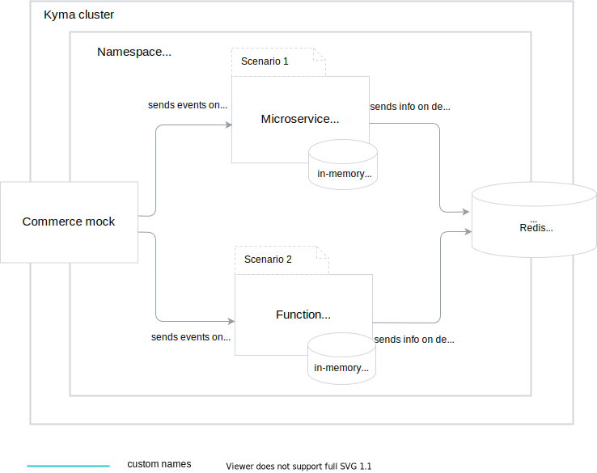

This set of Getting Started guides is an end-to-end scenario that will walk you through all major Kyma functionalities and show its:
- **Integration and connectivity** feature brought in by [Application Connector](https://kyma-project.io/docs/components/application-connector/). With Kyma, you can connect external applications and expose their APIs and events to the cluster.
- **Extensibility** feature provided by [Service Catalog](https://kyma-project.io/docs/components/service-catalog/). You can use its built-in portfolio of external services in your microservices and Functions.
- **Application runtime** feature supported by [Serverless](https://kyma-project.io/docs/components/serverless/). This feature lets your build microservices and Functions to interact with external services and applications, and to perform a given business logic.

With these features in mind, we will:

1. Create a microservice that can expose HTTP endpoints and receive a specific type of events from external applications. It has built-in in-memory storage for storing event details, but it can also work with the external Redis storage.
2. Provision the Redis service through Service Catalog and use it as an alternative database for the microservice.
3. Connect an external mock application to Kyma as an addon. We will use it to send events with order delivery details to the microservice.
4. Create a Function with the logic similar to that of the microservice. You will see how it, too, can be triggered by order events from the mock application and how it can save the order details in the external storage.

> **CAUTION:** These guides refer to a sample `orders-service` application deployed on Kyma as a `microservice`. This way it can be easily distinguished from external Commerce mock that represents an external monolithic application connected to Kyma. In Kyma docs, they are referred to as `application` and `Application` respectively.

All guides, whenever possible, demonstrate the steps in both kubectl and Console UI.

## Prerequisites

1. Install:

- [kubectl](https://kubernetes.io/docs/tasks/tools/install-kubectl/) (1.16 or greater)
- [curl](https://github.com/curl/curl)
- [Kyma](/root/kyma/#installation-install-kyma-on-a-cluster) on a cluster of your choice.

2. [Download the `kubeconfig` file](/components/security#tutorials-get-the-kubeconfig-file) with the cluster configuration.

## Main actors

Let's introduce the main actors that will lead us through the guides. These are our in-house examples, mock applications, and experimental services:

- [`orders-service`](https://github.com/kyma-project/examples/tree/master/orders-service) is a sample microservice written in Go. It can expose HTTP endpoints that can be used to create and read basic order JSON entities. The service can run with either an in-memory database that is enabled by default or an external Redis database. We will use it as an example to show you how you can use Kyma to deploy your own microservice, expose it on HTTP endpoints to make it available for external services, and then bind it to an external database service (Redis).

- [`orders-function`](https://github.com/kyma-project/examples/tree/master/orders-service/deployment/function.yaml) that is an equivalent of `orders-service`. Function's configuration allows you to save individual order data in its storage and retrieve multiple order records it. Like the microservice, the Function can run with either an in-memory database or a Redis instance.

- [Redis addon](https://github.com/kyma-project/addons/tree/master/addons/redis-0.0.3) is basically a bundle of two Redis services available in two plans: `micro` and `enterprise`. You will connect it to Kyma through Helm Broker and expose it in the Kyma cluster as an addon under Service Catalog. The Redis service represents an open-source, in-memory data structure store used as a database, cache, and message broker. For the purpose of these guides, you will use the `micro` plan with in-memory storage to demonstrate how it can replace the default memory of the microservice.

- [Commerce mock](https://github.com/SAP-samples/xf-addons/tree/master/addons/commerce-mock-0.1.0) is to act as an example of an external monolithic application which we want to extend with Kyma. It is based on the [Varkes](https://github.com/kyma-incubator/varkes) project and is also available in the form of an addon. It will simulate how you can pair an external application with Kyma and expose the application's APIs and events. In these guides, you will use its `order.deliverysent.v1` event type to trigger both the microservice and the Function.

## Steps

These guides cover the following steps:

1. [Create the `orders-service` Namespace](#getting-started-create-a-namespace) in which you will deploy all resources.
2. [Create a microservice](#getting-started-deploy-a-microservice) by deploying `orders-service` on the cluster in the created Namespace.
3. [Expose the microservice](#getting-started-expose-the-microservice) through the APIRule custom resource (CR) on HTTP endpoints. This way it will be available for other services outside the cluster so you can retrieve data from it and send sample orders to it. Since the microservice uses in-memory storage, when you send a sample order to its endpoint, the order details will be gone after you restart the microservice.
4. [Add the Redis service](#getting-started-add-the-redis-service) as an addon.
5. [Create the Redis service instance](#getting-started-create-a-service-instance-for-the-redis-service) (ServiceInstance CR) in the Namespace so you can bind it with the microservice and Function.
6. [Bind the microservice to the Redis service](#getting-started-bind-the-redis-service-instance-to-the-microservice) by creating ServiceBinding and ServiceBindingUsage CRs. Send a sample order to its endpoint. Since it now uses the Redis storage, the order details will not be gone after you restart the microservice.
7. [Connect Commerce mock](#getting-started-connect-an-external-application) as the external application.
8. [Trigger the microservice](#getting-started-trigger-the-microservice-with-an-event) to react to the `order.deliverysent.v1` event from Commerce mock. Send the event. Then, see if the microservice reacts to it and saves its details in the Redis database.
9. [Create a Function](#getting-started-create-a-function) in the Namespace and repeat the microservice flow:
- [Expose the Function](#getting-started-expose-the-function) through the APIRule CR on HTTP endpoints. This way it will be available for other services outside the cluster.
- [Bind the Function to the Redis service](#getting-started-bind-a-redis-service-instance-to-the-function) by creating ServiceBinding and ServiceBindingUsage CRs.
- [Trigger the Function](#getting-started-trigger-the-function-with-an-event) to react to the `order.deliverysent.v1` event from Commerce mock. Send the event. Then, see if the Function reacts to it and saves its details in the Redis database.

As a result, you get two scenarios of the same flow — a microservice and a Function that are triggered by new order events from Commerce mock and send the order data to the Redis database:

