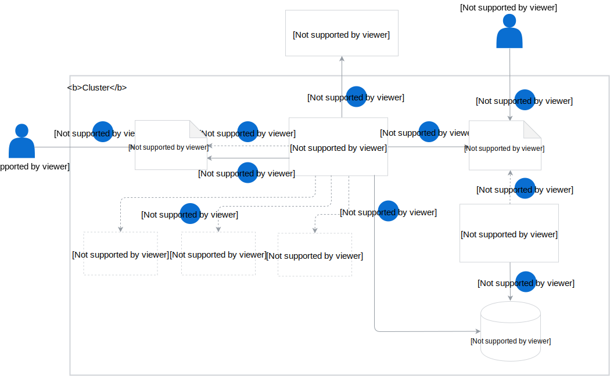

This diagram provides an overview of the basic Asset flow and the role of particular components in this process:

1. Create a bucket through a Bucket CR.
2. The Bucket Controller listens for new Events and acts upon receiving the Bucket CR creation Event.
3. The Bucket Controller creates the bucket in the MinIO Gateway storage.
4. Create an Asset CR which specifies the reference to the asset source location and the name of the bucket for storing the asset.
5. The AC listens for new Events and acts upon receiving the Asset CR creation Event.
6. The AC reads the CR definition, checks if the Bucket CR is available, and if its name matches the bucket name referenced in the Asset CR. It also verifies if the Bucket CR is in the `Ready` phase.
7. If the Bucket CR is available, the AC fetches the asset from the source location provided in the CR. If the asset is a ZIP or TAR file, the AC unpacks and optionally filters the asset before uploading it into the bucket.
8. Optionally, the AC validates, modifies the asset, or extracts asset's metadata if such a requirement is defined in the Asset CR. The AC communicates with the validation, mutation, and metadata services to validate, modify the asset, or extract asset's metadata according to the specification defined in the Asset CR.
9. The AC uploads the asset to MinIO Gateway, into the bucket specified in the Asset CR.
10. The AC updates the status of the Asset CR with the storage location of the file in the bucket.
